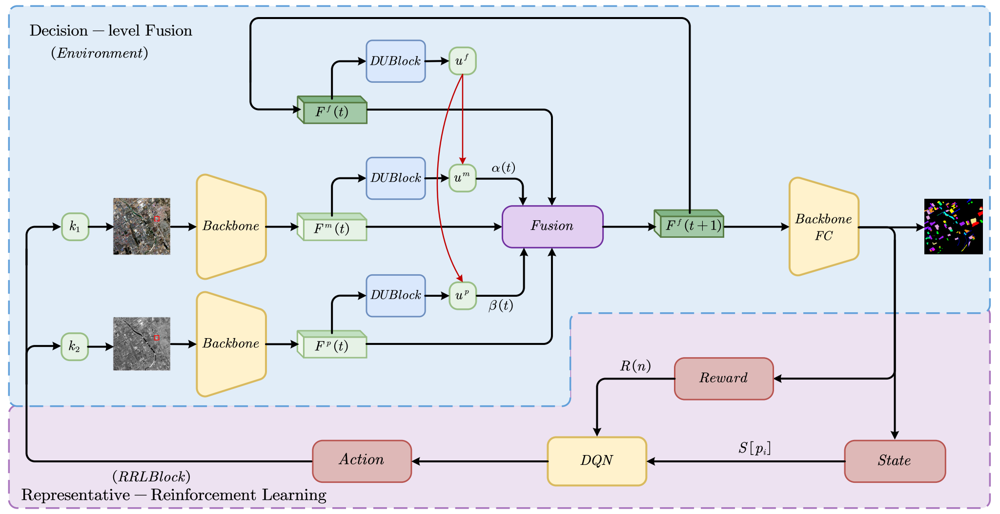

# Recurrent Progressive Fusion-based Learning for Multi-source Remote Sensing Image Classification

Code for " Recurrent Progressive Fusion-based Learning for Multi-source Remote Sensing Image Classification".

Xinchen Zhang, Hao Zhu,  Licheng Jiao,  Xiaotong Li, Biao Hou, Wenhao Zhao, Xiaoyu Yi, Wenping Ma

IPIU, Xidian University

> With the rapid development of earth observation technology, the classification of panchromatic (PAN) and multispectral (MS) images have excellent research value. However, with the acquisition of large amounts of data, the function space of the network degrades the generalization performance due to the inadequacy of the labeled samples. In this paper, we propose a recurrent progressive few-shot network (RPF-Net) for the classification of dual-source remote sensing images. It mainly consists of two parts: solving for the optimized fusion direction and adaptive feature-trusted decision-level fusion. In the first part, considering the problem of insufficient function space constraints under few-shot conditions, we propose representative-reinforcement learning, which performs the next fusion step by analyzing the state of the current moment and selecting the optimal action. This recurrent progressive propagation process allows the fusion features to be dynamically adjusted to give the optimal fusion direction in a larger function space under few-shot conditions. In the second part, considering that the importance of different source features in multiple fusions is different, we focus on uncertainty theory and perform focused decision-level fusion by analyzing the characteristics of different source features. This network can dynamically adjust the fusion direction and fusion method of features, solving the problem of too large function space under few-shot conditions. The results on multiple datasets have verified the effectiveness and stability of the proposed algorithm.



## Setting up a virtual conda environment

Setup a virtual conda environment using the provided `requirements.txt`.

```
conda create --name RPFNet --file requirements.txt
conda activate RPFNet
```
